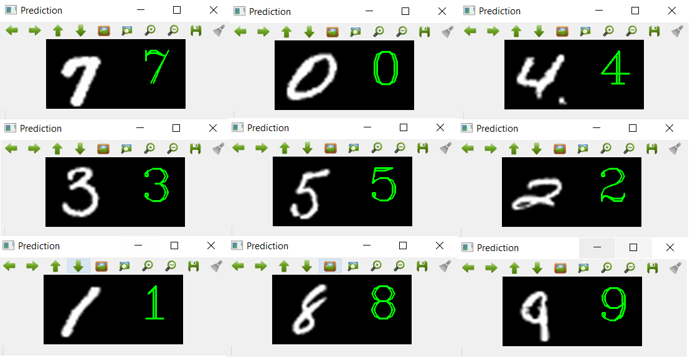
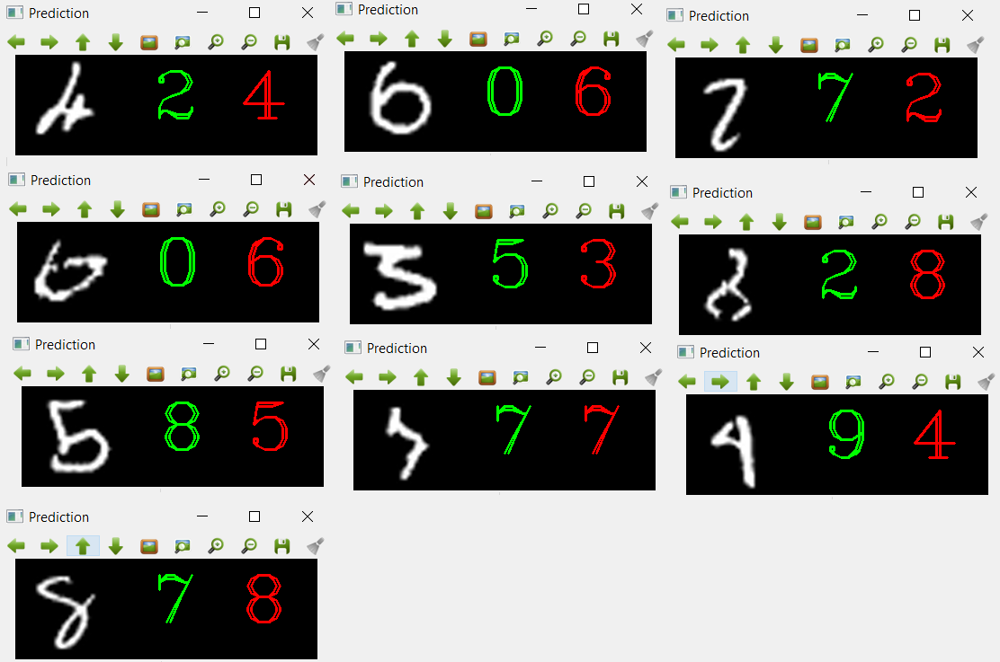

# HANDWRITTEN-DIGIT-CLASSIFIER

This Repo presents an implementation of Convolution Neural Networks (CNNs) [1] to achieve the classification of a very famous MNIST [2] database, which consists of 60,000 training samples and 10,000 test samples. This database has been extensively used for implementing various techniques in computer vision [3], CNN, and other deep learning techniques. We trained CNN for classifying handwritten digit images in the MNIST database with 10 different labels ranging from 0-9. Here we used plots of loss and accuracy of both training and validation process for determining the efficiency of CNN.In this dataset, we achieved 98.62% accuracy on validation samples and loss of ~4% on training samples. The presented neural network consists of 2 hidden layers, each of them are accompanied by ReLU nonlinearity property followed by softmax layer. Overfitting or generalization of a model is checked by using Dropout regularization technique. Stochastic Gradient Descent optimizer is used to train the network. Finally correctly predicted and misclassified data has been compared with correct labels and summary is presented.

<h3>Experimental Setup</h3>

System Specifications
  <ul>
    <li>
Processor: Intel(R) Core i7-9750H</li>
 <li>RAM: 16.0 GB</li>
 <li>System type: 64-bit</li>
 <li>GPU: Nvidia 1660 Ti
</li></ul>
Setting up the System
Download Anaconda with Python 3.6+
After downloading Anaconda, go to the folder where it was saved and then run Anaconda Command Shell from there to open Anaconda Navigator.

 Create Environment
Go to Environment → Create Environment → create a new environment called ‘cv’ (or anything you like) using Python 3.6+ (not 3.7, because some dependencies of Tensorflow are not supported in Python 3.7+).

Install Jupyter Notebook
Go to Anaconda Navigator and change the environment to the one you just created and install jupyter notebook in that environment.

Install Dependencies
Open the jupyter notebook, create a folder wherever you like and create an ipynb file for installing dependencies in this environment.
Assuming ‘cv’ is the name you choose for your environment.
<ul>
  <li>
Pip install --upgrade pip</li>
<li>Pip install tensorflow-gpu</li>
<li>Pip install keras</li>
<li>Conda install scikit-learn</li>
<li>Pip install Pillow</li>
<li>Conda install -c conda-forge opencv</li>
<li>Python -m pip install -U matplotlib</li>
<li>Pip install pandas</li>
<li>Pip install tqdm</li>
<li>Pip install pydot</li>
<li>Pip install scikit-image</li>
<li>Pip install graphviz</li>
<li>Pip install keras-vis
  </li></ul>

<h3>Classified Output </h3>

<h3>Misclassified Output </h3>

